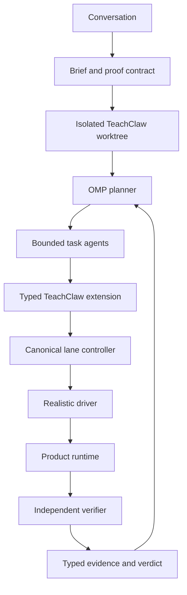

# Architecture

## Design Goal

Use language models for ambiguity, implementation and realistic interaction.
Use deterministic software for environment state, synchronisation, ownership,
assertions and cleanup.



## Launcher

The launcher is the only entrypoint. It verifies toolchain compatibility,
selects the current worktree, creates a linked worktree only from clean primary
`main`, repairs dependencies only when necessary, initialises lane state and
starts OMP with the checked-in config and extension.

OMP sessions are stored under the ignored lane directory so orchestration
evidence follows the worktree without entering Git.

## OMP

OMP remains stock orchestration. TeachClaw does not fork its planner or invent a
second agent scheduler.

- `workflowz` starts the parent through the planning role.
- Generic batched workers resolve through the task role.
- Explicit model selection remains authoritative.
- Specialist agents are used only for a genuinely distinct contract.
- Shared mutable runtime phases use explicit handoffs.

## Role Routing

| Role | Work |
| --- | --- |
| default | normal interactive development |
| plan | decomposition, sequencing and proof design |
| task | bounded implementation or operation |
| slow | ambiguous diagnosis and high-risk reasoning |
| commit | mechanical commit-shaped closeout |
| tiny | small deterministic edits |

Model names may change; the role contract should remain stable.

## Extension

The TeachClaw extension is thin. It validates the repo, resolves the branch,
classifies actions by approval tier, refuses mutation on `main`, applies
destructive-command guards, calls the controller and returns redacted typed
results.

It exposes two families:

- `teachclaw_lane`: environment and lifecycle actions;
- `teachclaw_proof`: bounded scenario drivers whose logic does not belong in
  the controller.

## Lane Controller

The controller owns the operational state machine:

- lane identity and owned paths;
- ports, database and process records;
- app, worker and gateway lifecycle;
- committed runtime mirrors;
- tester ownership and synchronisation;
- provenance and evidence roots;
- guarded cleanup.

It does not decide what a teacher should say, whether a slide deck looks good,
or whether marking judgement is pedagogically sound.

## Driver and Verifier

Drivers preserve the real user story. They can navigate a browser, attach files,
send committed teacher turns and inspect rendered output.

Verifiers operate independently over saved state. They assert exact identifiers,
counts, statuses, provenance, frame totals, reports, feedback, active jobs and
cleanup. Old chat messages and previous runs are baselined so stale evidence
cannot pass a new scenario.

## Context Budget

Agents do not auto-load every skill or rule pack. The intended context path is:

```text
root rules → task router → one relevant skill → current code and evidence
```

History is queried when needed rather than treated as startup truth. Workers
receive their bounded contract, not the entire parent conversation or sibling
transcripts.
